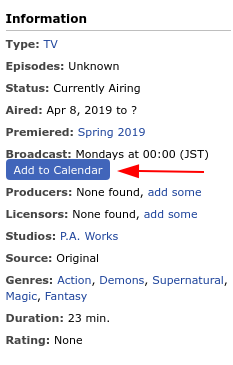
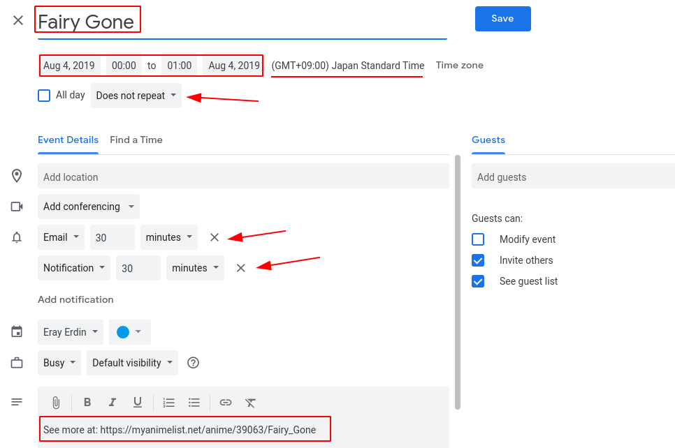

# malcalendar

[][openuserjs_url]

[openuserjs_url]: https://openuserjs.org/scripts/erayerdin/malcalendar

malcalendar is a userscript to add MyAnimeList anime entries to Google Calendar.

It is also probably the first userscript to be developed with
Typescript. (?)

This script needs a userscript extension for your browser. You can
get Tampermonkey from [here][tampermonkey_url].

[tampermonkey_url]: https://tampermonkey.net

## Usage

After you install the script, each anime page on MyAnimeList will
have "Add to Calendar" button on the left "Information" panel.

When you click on the button, you will be redirected to Google
Calendar's new event page.

The information below is already set:
 - Date and time (for 1 hour period)
 - Title
 - Description

You can change these data if you want to. I also suggest you to
repeat the event every week for how many episodes the anime will
air as well. You can also fill in how you wish to get notification
for the event, like email or native Android notifications.
